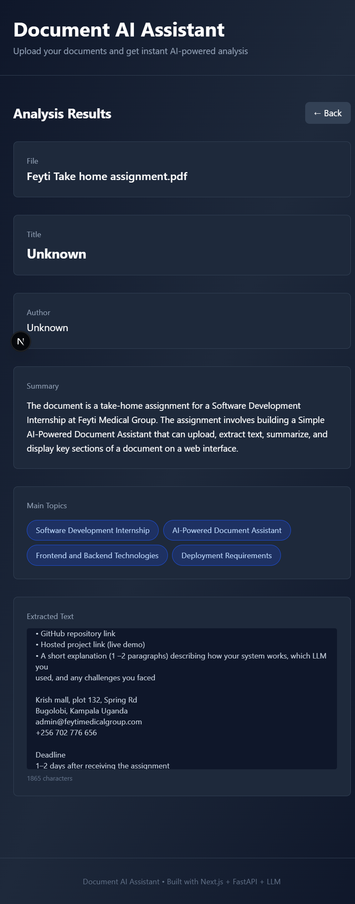
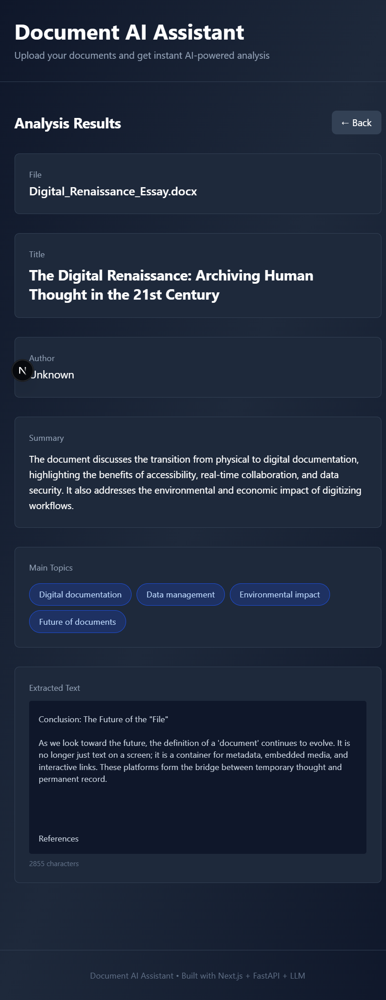

# Document AI Assistant

This is a Simple AI-Powered Document Assistant that lets you upload a document (pdf, .txt or docx file), it extracts text from the upload and uses an LLM to summarize the document. It will identify key sections such as title, author, and main content and then display the results on a simple web interface.

## Project Overview

I built a full-stack web app that lets users upload documents (PDF, DOCX, TXT) and get AI-powered summaries and key topics extracted. This was a 48-hour portfolio project to demonstrate my full-stack development skills.

## Tech Stack

- **Frontend:** Next.js + React + Tailwind CSS
- **Backend:** FastAPI + Python
- **Document Processing:** LangChain document loaders (PyPDFLoader, Docx2txtLoader, TextLoader)
- **AI/LLM:** OpenAI API (gpt-3.5-turbo)
- **Deployment:** Vercel (frontend), Render (backend)

## Why These Choices?

- **LangChain loaders:** Simpler and faster than trying to build custom PDF/DOCX parsers. One method handles all formats.
- **OpenAI API:** More reliable than local LLMs. No dependency management issues. Proven production-grade service.
- **Next.js + FastAPI:** Clean separation of concerns. Next.js handles UI beautifully, FastAPI is minimal and fast for the backend.

## Setup & Running Locally

### Backend
```bash
cd backend
python -m venv venv
source venv/bin/activate
pip install -r requirements.txt
cp .env.example .env
# Add your OPENAI_API_KEY to .env
python -m uvicorn main:app --reload --host 0.0.0.0 --port 8000
```

### Frontend
```bash
cd frontend
npm install
cp .env.local.example .env.local
npm run dev
# Opens on http://localhost:3000
```

## How It Works

1. User uploads document (PDF/DOCX/TXT)
2. Backend saves file temporarily
3. LangChain loader extracts text (auto-detects format)
4. Text sent to OpenAI with structured prompt
5. LLM returns summary, title, author, main topics
6. Frontend displays results





## API Endpoint

### POST /process
Uploads and analyzes a document.

**Request:**
```bash
curl -X POST http://localhost:8000/process \
  -F "file=@document.pdf"
```

**Response:**
```json
{
  "filename": "document.pdf",
  "extracted_text": "...",
  "summary": "...",
  "title": "...",
  "author": "...",
  "main_topics": ["topic1", "topic2"]
}
```

## Challenges & Solutions

[Be honest about what went wrong and how you fixed it]

Example:
- **Unstructured library install issues:** Initially tried `unstructured[pdf,docx]` library but ran into system dependency issues. Pivoted to LangChain's simpler document loaders.
- **OpenAI API key validation:** API key appeared active but had payment issues. Fixed by updating billing settings in OpenAI platform.
- **DOCX file handling:** Missing `docx2txt` dependency. Added to requirements.txt.

## File Structure
```
document-ai-assistant/
├── backend/
│   ├── main.py              # FastAPI app
│   ├── llm_handler.py       # LangChain + OpenAI logic
│   ├── requirements.txt
│   └── .env.example
│
├── frontend/
│   ├── app/
│   │   ├── page.tsx         # Main component
│   │   ├── layout.tsx
│   │   └── globals.css
│   ├── package.json
│   └── .env.local.example
│
├── .github/workflows/       # CI/CD
├── .gitignore
└── README.md
```

## Deployment

Backend deployed to: [your Render URL]
Frontend deployed to: [your Vercel URL]

See DEPLOYMENT.md for detailed steps.

## What I'd Do Differently

- Set up tests from the start (would have caught issues faster)
- Research dependencies more thoroughly upfront (there was difficulty choosing which libraries or packages to use for the document upload and processing)
- Use environment-specific configs earlier (separate configs for dev/prod)

## Learning Outcomes

- Full-stack JavaScript/Python development
- Working with LLMs and structured output
- Document processing and text extraction
- API design and error handling
- Deployment pipelines

---